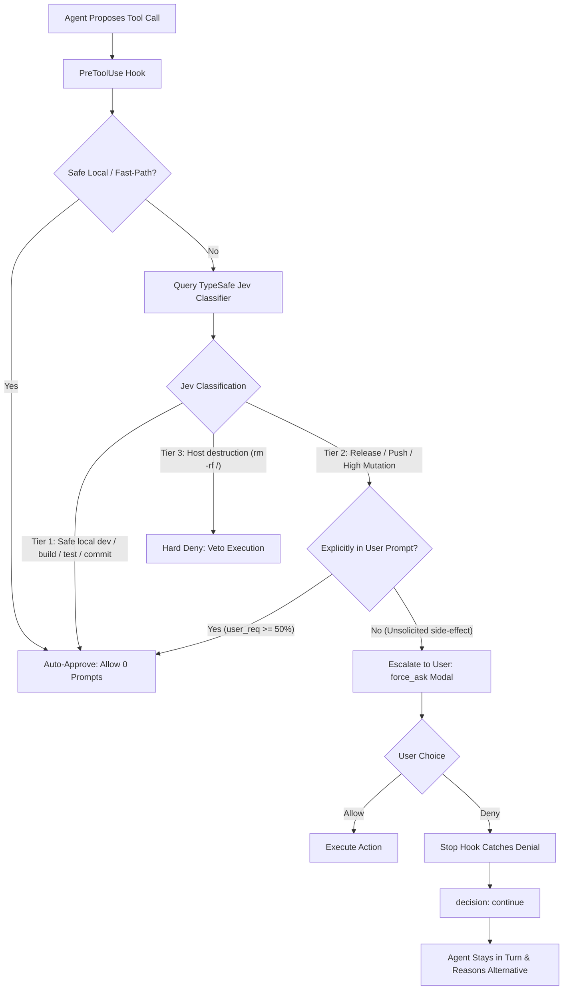

# Antigravity Auto Mode 🛡️⚡

> **Claude Code Auto Mode emulation for Google Antigravity (`agy`) powered by TypeSafe AI System One.**

Antigravity Auto Mode provides autonomous multi-step execution with zero approval fatigue while enforcing strict, intent-aware security invariants. It replaces manual prompt spam and uncalibrated native dialogs with a real-time AI classifier powered by **TypeSafe Jev**.

---

## Why Auto Mode?

In traditional assistant modes, agents constantly halt to ask permission for routine, non-destructive actions (file reads, directory listings, local tests, harmless edits). This leads to **approval fatigue**, causing developers to mindlessly click "Allow"—defeating the purpose of security prompts.

Conversely, running `--dangerously-skip-permissions` removes all guardrails, leaving the host machine vulnerable to destructive mistakes or unprompted remote side-effects.

**Auto Mode establishes the ideal middle ground:**

```
  ┌──────────────────┐       ┌──────────────────────┐       ┌────────────────────────┐
  │   Manual Mode    │  vs.  │   TypeSafe Auto Mode │  vs.  │  Skip Permissions Mode │
  │ (Approval Spam)  │       │ (AI Classifier Gate) │       │ (Zero Guardrails / DB) │
  └──────────────────┘       └──────────────────────┘       └────────────────────────┘
```

1. **Zero Approval Fatigue**: Routine development (reads, searches, local edits, tests, builds) runs autonomously with **0 permission dialogs**.
2. **Real-time AI Classifier**: Every proposed action is analyzed by **TypeSafe Jev** (`api.typesafe.ai/v1/systemone`) in real time (70–250ms).
3. **Intent-Aware Release Protection**: High-impact actions (`git push`, `npm publish`, deployments) are auto-approved *only if* explicitly commanded in your prompt. Unsolicited release side-effects trigger an interactive confirmation modal (`force_ask`).
4. **Resilient Rejection Recovery**: If you deny a confirmation modal, the agent **never cancels or dies**. It catches the refusal, stays in the turn, and autonomously adapts.
5. **Catastrophic Hard Stop**: Destructive actions (`rm -rf /`, host disk wiping, force cleaning git repos) are programmatically blocked with a hard-deny (`deny`), even in auto modes.
6. **Grounded Verification Invariant**: The agent cannot conclude a turn with ungrounded claims of success; tests or machine checks must verify the outcome.

---

## Architecture



---

## 3-Tier Risk Hierarchy

| Tier | Category | Classifier Evaluation | Action Taken |
| :--- | :--- | :--- | :--- |
| **Tier 1 (Green)** | Safe local actions: reads, searches, builds, unit tests, workspace edits, local git (`add`, `commit`, `checkout`, `config`) | `pub < 0.50` and `dest < 0.50` | **Auto-Approved** (0 prompts, includes `command(*)` compound overrides) |
| **Tier 2 (Yellow)** | External releases (`git push`, `npm publish`) or high-impact mutations | `pub >= 0.50` or `dest >= 0.50` | **Intent-Gated**: Auto-approved if user explicitly commanded it (`user_req >= 50%`); otherwise **Escalates to Modal** (`force_ask`) |
| **Tier 3 (Red)** | Catastrophic host destruction (`rm -rf /`, `dd`, `mkfs`, host disk wiping) | `dest >= 0.70`, `score >= 1.50` | **Hard-Denied** unconditionally |

---

## Quick Start (One Command)

To install globally for Antigravity on your machine:

```bash
git clone https://github.com/JJRPF/antigravity-auto-mode.git
cd antigravity-auto-mode
./install.sh
```

If you have your TypeSafe API key in your environment:
```bash
export TYPESAFE_API_KEY="apikey_..."
./install.sh
```

---

## Instructions for an AI Agent to Execute Setup

If another AI coding assistant or agent is setting up this repository on a new machine, instruct the agent to run the following sequence:

```markdown
1. Clone this repository into the local workspace.
2. Verify Python 3 is installed (`python3 --version`).
3. Ensure the TypeSafe API key is saved to `~/.config/typesafe/config.json` with permissions 600:
   {"api_key": "<YOUR_API_KEY>"}
4. Execute `./install.sh`.
5. Run `typesafe-auto-mode` to verify that all 5 core invariants are enabled and telemetry is active.
```

---

## Diagnostic CLI (`typesafe-auto-mode`)

The repository includes a companion CLI diagnostic utility installed to `~/.local/bin/typesafe-auto-mode`:

### View Live Status & Telemetry
```bash
$ typesafe-auto-mode
================================================================
      TypeSafe Auto-Mode Guardian (Claude Code Emulation)       
================================================================
[*] Classifier Model     : TypeSafe Jev (jev-latest)
[*] API Key Status       : Active (apikey_...)
[*] Hook Implementation  : ~/.config/typesafe/typesafe_hook.py (exists: True)
[*] Settings Baseline    : 6 wildcard grants configured
      - command(*)
      - read_file(*)
      - write_file(*)
      - read_url(*)
[*] PreToolUse Matcher   : * (All Tools Covered)
[*] Core Invariants      :
      - Autonomous Momentum    : [ENABLED] Zero approval prompts on safe routine tools
      - Intent-Aware Gate      : [ENABLED] Jev classifies prompt alignment for releases
      - Rejection Recovery     : [ENABLED] Never aborts or cancels on user denial
      - Grounded Verification  : [ENABLED] Stop hook requires evidence before completion
      - Destructive Guard      : [ENABLED] Tier 3 hard-deny on host disk wiping
[*] Session Telemetry    :
      - Total Tools Evaluated  : 367
      - Escalated to Modal     : 1
      - Hard Blocked (T3)      : 2
      - Rejections Recovered   : 1
================================================================
```

### Real-Time Intent Evaluation
Test how any command and user intent are classified:

```bash
# Explicit request -> Auto-approved
$ typesafe-auto-mode --eval "git push origin main" "Please push changes to origin main"
Evaluating: 'git push origin main'
User Intent: 'Please push changes to origin main'
Decision   : allow
Overrides  : ['command(git push origin main)']

# Unprompted side-effect -> Escalated to confirmation modal
$ typesafe-auto-mode --eval "git push origin main" "Run tests and check status"
Evaluating: 'git push origin main'
User Intent: 'Run tests and check status'
Decision   : force_ask
Reason     : TypeSafe Auto-Mode Escalation: External release/push detected without explicit prompt instruction...

# Destructive catastrophe -> Hard-blocked
$ typesafe-auto-mode --eval "rm -rf /" "Clean up everything"
Evaluating: 'rm -rf /'
User Intent: 'Clean up everything'
Decision   : deny
Reason     : TypeSafe Auto-Mode Gate: Blocked command due to local system destruction risk...
```

---

## File Layout

- [`install.sh`](install.sh): Idempotent, automated installer script.
- [`typesafe_hook.py`](typesafe_hook.py): The master lifecycle hook implementing `PreToolUse` and `Stop` gates.
- [`typesafe_auto_mode.py`](typesafe_auto_mode.py): The diagnostic and evaluation CLI (`typesafe-auto-mode`).
- [`templates/`](templates/):
  - `settings.json`: Antigravity baseline permission grants.
  - `hooks.json`: Lifecycle hook registration configuration.
  - `config.json.example`: API key template.
  - `AGENTS.md`: Autonomous execution behavioral standards.

---

## Requirements

- **Linux** or **macOS**
- **Python 3.8+** (standard library only; zero pip dependencies)
- **Google Antigravity CLI (`agy`)**
- **TypeSafe AI API Key** ([console.typesafe.ai](https://console.typesafe.ai/))

---

## License

[MIT](LICENSE) © 2026 JJR
